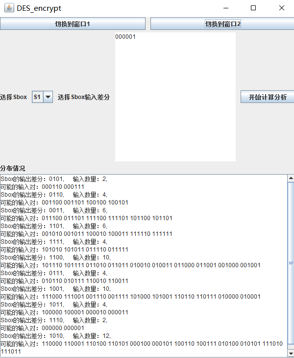

# DES加密解密
- - -
## 使用说明
- 使用方法：
	- 在该jar应用程序目录下打开命令行，输入`java -jar project07_DES.jar`后，回车运行即可。
- - -
## DES作业
### 内容
1. 网上搜索DES的源代码。
2. 利用DES源代码实现下面功能：
1. 给定某个Sbox的输入差分情况下，计算所有输入对和所有Sbox输出差分的分布情况
2. 统计DES算法在密钥固定情况，输入明文改变1位、2位，。。。64位时。输出密文位数改变情况。
3. 统计DES算法在明文固定情况，输入密钥改变1位、2位，。。。64位时。输出密文位数改变情况。
为了具有客观性，2，3小题需要对多次进行统计，并计算其平均值。
- - -
## GUI界面

